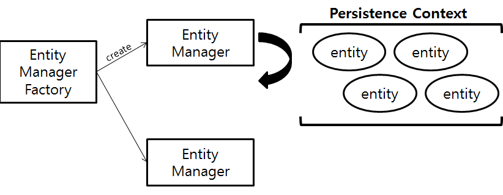

# JPA Getting Started - 2

## 영속성(Persistence) 관리
JPA를 사용하면 어플리케이션과 데이터베이스 사이에 영속성 컨텍스트(Persistence Context)라는 개념을 두고 데이터를 관리한다.  
영속성 컨텍스트란 무엇인지 어떻게 생성, 관리되는지 알아보자.  


참조 : https://docs.jboss.org/hibernate/entitymanager/3.6/reference/en/html_single/

#### 엔티티 매니저 팩토리(EntityManagerFactory)
- 주 목적은 EntityManager 인스턴스를 관리하는 것이다.
- EntityManagerFactory 생성시 커넥션 풀도 함께 생성한다.
- 같은 EntityManagerFactory를 통해 생성되는 EntityManager는 같은 database에 접속한다.
- 한 번 생성 후 어플리케이션 전체에서 공유된다.
- J2SE 환경에서 javax.persistence.Persistence 부트스트랩 클래스를 통해 생성할 수 있다.
```java
EntityManagerFactory emf = Persistence.createEntityManagerFactory("mydb");
```
- Spring과 같은 J2EE환경에서는 **@PersistenceUnit** 을 통해 EntityManagerFactory를 얻을 수 있다.  
  하지만, **@PersistenceContext** 를 통해 EntityManager 를 주입 받아 사용할 수 있기 때문에 잘 사용하지 않는다.
```java
@Repository
public class MyRepository {
    @PersistenceUnit
    EntityManagerFactory emf;
    ....
}
```
- EntityManagerFactory는 hibernate의 SessionFactory와 유사하다.

#### 엔티티 매니저(EntityManager)
- 엔티티를 저장, 수정, 삭제, 조회등 엔티티와 관련된 작업을 수행
- Application-managed entity manager: 다음과 같은 코드로 엔티티매니져를 생성 및 제어한다.
```java
EntityManger em = emf.createEntityManager();
```
- Container-managed entity manager: J2EE환경에서 컨테이너가 엔티티매니져를 생성하고 트랜젝션 경계(boundary)를 결정.
```java
@Repository
public class MyRepository {
    @PersistenceContext
    EnitityManger em;
    ....
}
```
- EntityManager(javax.persistence.EntityManager)는 hibernate의 Session(org.hibernate.Session)과 유사
```java
em.find();    // 엔티티 조회
em.persist(); // 엔티티 저장
em.remove();  // 엔티티 삭제
em.flush();   // 영속성 컨텍스트 내용을 데이터베이스에 반영
em.detach();  // 엔티티를 준영속 상태로 전환
em.merge();   // 준영속 상태의 엔티티를 영속상태로 변경
em.clear();   // 영속성 컨텍스트 초기화
em.close();   // 영속성 컨텍스트 종료
```

#### 영속성 컨텍스트(persistence context)
```java
entityManager.persist(entity);  // 엔티티를 영속성 컨텍스트에 저장
```
- 어플리케이션과 데이터베이스 사이에 존재하는 논리적인 개념으로 엔티티를 저장하는 환경을 의미한다.
- 엔티티매니저를 통해서만 접근이 가능하다.
- J2EE 환경에서는 여러 엔티티메니저가 하나의 영속성컨텍스트를 공유한다.
- 영속성 컨텍스트에 존재하는 **엔티티**는 **플러시** 호출시 **데이터베이스에 반영** 된다.
  * **entityManger.flush()** 로 플러시 직접 호출
  * **트랜젝션 커밋(commit)** 시 플러시 자동 호출
  * **JPQL 쿼리 실행** 시 플러시 자동 호출
- 영속성 컨텍스트의 장점
  * 1차 캐시: 엔티티 조회시 영속성 컨테스트에 존재하면 바로 리턴, 없으면 데이터베이스 조회 후 리턴.
  * 동일성(==)보장: 조회시 항상 같은 엔티티 인스턴스를 리턴(주소값이 같음)
  * 트랜잭션을 지원하는 쓰기 지연(Transactional write-behind): 트랜젝션 커밋 될때까지 내부 쿼리저장소에 모아뒀다가 한번에 실행
  * 변경감지(Dirty Checking): 엔티티의 스냅샷을 유지하면서 엔티티의 변경사항을 체크한다. update쿼리가 항상 같음.
  * 지연로딩(Lazy Loading): 연관된 엔티티를 모두 불러오는 것이 아니라, 실제 호출될때 로딩되도록 지원(프록시 객체 사용)

#### 엔티티 생명주기

- New(Transient): new 로 생성만 된 상태로, 영속성 컨텍스트와 관련이 없는 엔티티
```java
Customer customer = new Customer();
```
- Managed(Persistent) : 영속성 컨테스트에서 관리되는 엔티티. 반드시 식별자를 갖는다.
```java
entityManger.persist(customer);
```
- Detached: 영속성 컨텍스트에 존재하다가 분리된 엔티티. 식별자를 갖고 있다.
```java
entityManger.detach(customer);
entityManger.clear();
entityManger.close();
```
- Removed: 영속성 컨텍스트와 데이터베이스에서 삭제된 엔티티
```java
entityManger.remove(customer);
```

#### 엔티티 CRUD
- 엔티티 조회: **em.find(entity)** 로 영속성 컨텍스트 내의 1차 캐시에서 먼저 찾고 없으면 데이터베이스에서 조회.
em.find를 통해 새로 DB에서 조회된 엔티티는 영속성 컨텍스트에서 관리한다.
```java
Customer customer = entityManger.find(Customer.class, "cutomerId1");
```

- 엔티티 등록: **em.persist(entity)** 로 영속성 컨텍스트에 저장.
트랜젝션 커밋 전까지 메모리에 SQL을 유지하며 쓰기 지연 후 커밋시 db에 일괄 반영한다.
```java
// J2SE에서 트랜젝션 사용. Spring에서는 @Transaction 으로 트랜젝션 지정
EntityTransaction tx = entityManger.getTransaction();
tx.begin();
entityManger.persist(newCustomer1);  // 영속성 컨텍스트에 반영
entityManger.persist(newCustomer2);  // 영속성 컨텍스트에 반영. 여기까지 쓰기 지연 발생
tx.commit();  // 데이터베이스에 반영
```

- 엔티티 수정: 엔티티 수정을 위한 **별도의 API가 없다**. 영속성 컨텍스트에서 엔티티의 스냅샷을 유지하며
트랜젝션 커밋시 **변경감지(dirty checking)** 를 통해 수정된 엔티티의 UPDATE SQL 생성 후 반영
```java
Customer customer = entityManger.find(Customer.class, "cutomerId1");
customer.setName("new name");  // 트랜젝션 커밋시 변경감지 후 반영 됨.
```
> 수정 쿼리를 작성하다보면, 이름만 변경하는 쿼리, 이름+나이를 변경하는 쿼리 등..
  요건에 따라 속성별로 수정하는 UPDATE SQL 문이 계속 추가된다.
  이 경우.. 스키마 변경시 수정할 쿼리도 많아질 뿐만 아니라..
  SQL이 비즈니스 로직에 종속될 뿐만 아니라, 데이터베이스에서 쿼리 재사용이 어렵다.

- 엔티티 삭제: **em.remove(entity)** 로 엔티티를 삭제.
영속성 컨텍스트에서 바로 삭제되고, 트랜젝션 커밋 될때까지 쓰기 지연된다.
삭제한 엔티티는 재사용하지 말고, JVM에의해 가비지컬랙션 되도록 한다.
```java
Customer customer = entityManger.find(Customer.class, "cutomerId1");
entityManger.remove(customer);  // 트랜젝션 커밋시 반영됨.
```
