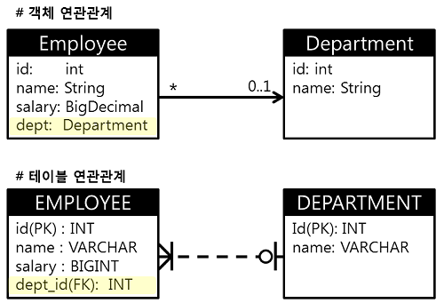
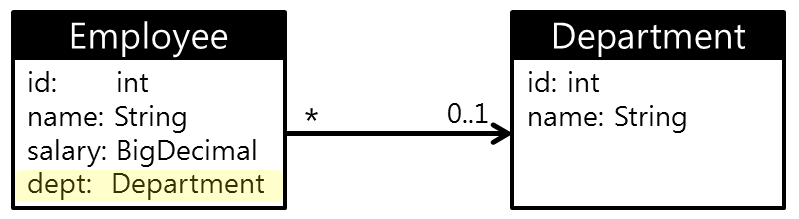
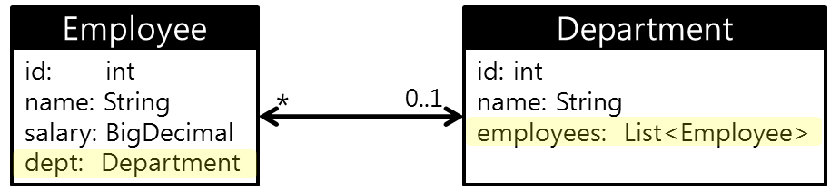
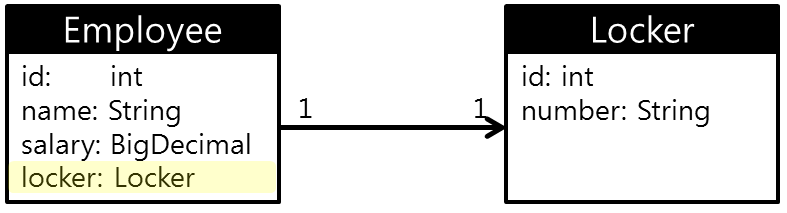
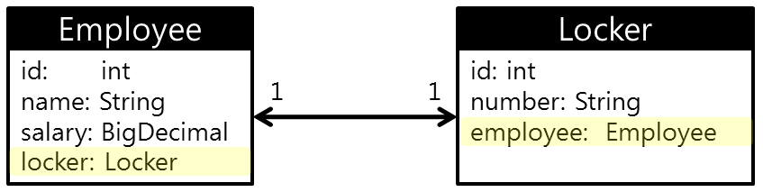
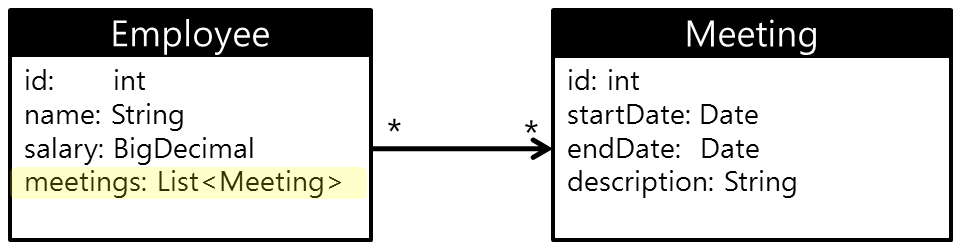
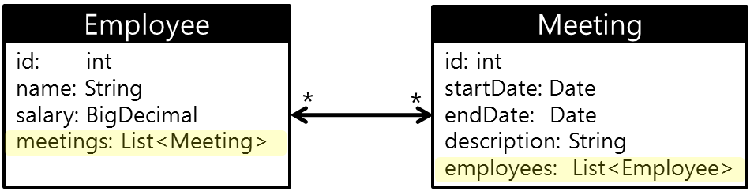
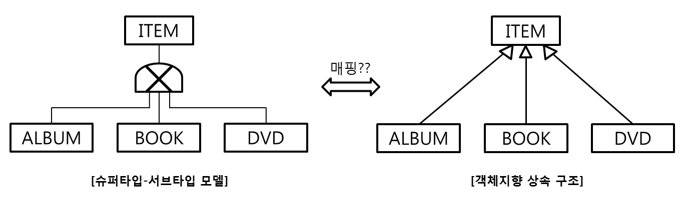
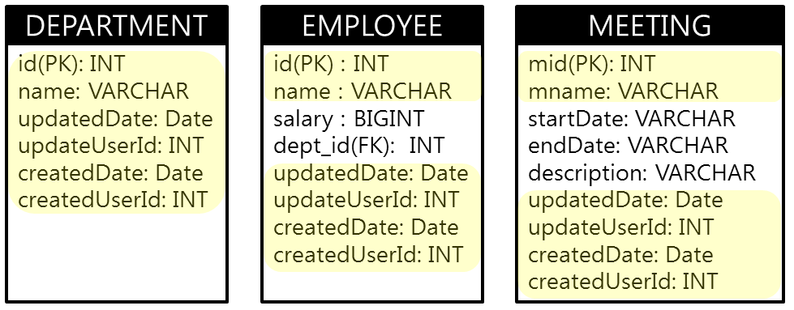
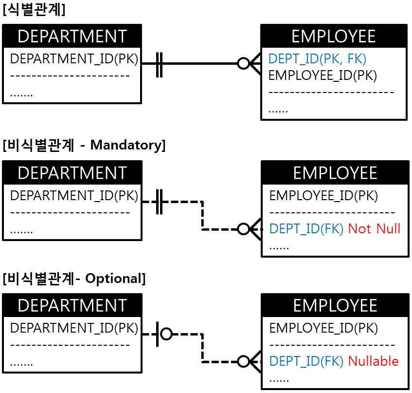

# JPA Getting Started - 3

앞에서 영속성 컨텍스트에 객체(엔티티)를 저장하는 것을 보았다.  
객체와 관계형 데이터베이스의 다른 개념을 어떻게 매핑하고 데이터가 반영되는지 알아보자.  

## 엔티티 매핑
객체(엔티티)를 영속성 컨테스트에 저장(persist) 후 트랜젝션이 커밋되는 시점에  
각 데이터베이스에 맞는 SQL을 생성하여 데이터베이스로 보내진다.  
객체를 어떻게 엔티티로 만들고 테이블과 매핑하는지 알아보자.  

#### 객체와 테이블 매핑 Annotation
객체(Entity)와 데이터베이스 Table을 매핑할 때 아래의 어노테이션을 사용한다.
- @Entity: JPA에서 테이블에 매핑할 클래스에 붙임. 해당 클래스는 엔티티라 부른다.
  * 기본생성자(default constructor)는 필수
  * final class, enum, interface, inner class에 사용 불가. final 필드 사용 불가  
  -> runtime시에 javassist에 의해 Entity의 서브클래스 생성하기 때문. 클래스 상속 불가하면 안됨  
- @Table: 엔티티와 매핑할 테이블명을 지정
- @Id: 기본키(primary Key) 매핑
- @Column: 테이블의 컬럼명 매핑. 지정안하는 경우 객체 필드명과 동일하게 지정
- @Enumerated: 자바의 enum 타입을 사용하는 경우 지정
- @Temporal: 날짜 타입(Data, Calendar) 매핑시 사용. (DATE, TIME, TIMESTAMP)
- @Lob: CLOB, BLOB 타입과 매핑시
- @Transient: 테이블 컬럼에 매핑되지 않는 필드에 지정.
- @Access: JPA가 엔티티 데이터에 접근하는 방식 지정. FILED가 기본값. 필드(FILED) or Getter(PROPERTY).

```java
@Enitity
@Table(name="CUSTOMER")
public class Customer {
  @Id
  private String id;

  @Column("FIRST_NAME")
  private String firstName;

  @Column("LAST_NAME")
  private String lastName;

  @Enumerated(EnumType.STRING)
  private CustomerType type;  // public enum CustomerType { GOLD, SILVER, BASIC }

  @Temporal(TemporalType.TIMESTAMP)
  private java.util.Date createdDate;

  @Lob
  private String description;

  @Transient
  private String tempVal;

  @Access(AccessType.PROPERTY)
  public String getFullName() {
    return firstName + " " + lastName;
  }
}
```

#### DB Schema 자동생성
엔티티에 DB Schema 정보를 위의 어노테이션을 이용해 매핑해 놓았기 때문에  
JPA를 통해 DDL을 자동 생성할 수 있는 기능을 제공한다.(실제 운영환경에서 사용하기에는 위험한 기능이다.)  

**spring.jpa.hibernate.ddl-auto** 속성을 통해 설정한다.  
```
spring.jpa.hibernate.ddl-auto: validate  # spring.jpa.properties.hibernate.hbm2ddl.auto 속성과 와 동일
```
- create: 기존 테이블 삭제 후 새로 생성
- create-drop: 기존 테이블 삭제 후 새로 생성 + 어플리케이션 종료시 DDL 제거
- update: 테이블과 엔티티 매핑정보 비교 후 변경내용만 반영
- validate: (권장) 테이블과 엔티티 매핑정보 비교 후 변경사항 있는 경우 경고 출력. 어플리케이션 실행 안됨.

#### 기본키 매핑 전략
각 테이블 마다 데이타를 유니크하게 식별하기 위해 기본키를 가지고 있다.  
JPA에서는 다음과 같은 기본키 생성 전략을 지원한다.  

- **직접 할당**: em.persist() 호출전에 직접 세팅한다.
```java
Order order = new Order();
order.setId("ORDER_00001");  // pk 직접 생성 후 세팅
em.persist(order);
```
- **IDENTITY**: 기본키 생성을 데이터베이스에 위임. MySQL에서 AUTO_INCREMENT 를 지정해 둔 경우 사용.
영속성 컨텍스트에 엔티티를 저장하려면 반드시 식별자가 필요하기 때문에, IDENTITY 전략 사용시 즉시 DB반영된다.(쓰기지연 X)
```java
@Entity
public class Order {
    @Id
    @GeneratedValue(strategy=GenerationType.IDENTITY)
    private String id;
    ...
}
```
- **SEQUENCE**: 데이터베이스 시퀀스를 사용하여 기본키를 생성한다.
```java
// CREATE SEQUENCE ORDER_SEQ START WITH 1 INCREMENT BY 1;
@Entity
@SequenceGenerator(name="ORDER_SEQ_GENERATOR", sequenceName="ORDER_SEQ", initialValue=1, allocationSize=1)
public class Order {
    @Id
    @GeneratedValue(strategy=GenerationType.SEQUENCE, getnerator="ORDER_SEQ_GENERATOR")
    private String id;
    ...
}
```
- **TABLE**: 키생성을 위한 전용 테이블을 사용하여 시퀀스와 비슷하게 기본키를 생성한다.  
```java
// CREATE TABLE TB_SEQUENCE ( sequence_name varchar(255) not null, next_val bigint, primary key (sequence_name) )
@Entity
@TableGenerator(name="ORDER_SEQ_GENERATOR", table="TB_SEQUENCE", pkColumnValue="ORDER_SEQ", allocationSize=1)
public class Order {
    @Id
    @GeneratedValue(strategy=GenerationType.TABLE, getnerator="ORDER_SEQ_GENERATOR")
    private String id;
    ...
}
```

| sequence_name  | next_val       |  
| -------------- | -------------- |  
| CUSTOMER_SEQ   | 2              |  
| ORDER_SEQ      | 100            |  
| ...            | ...            |  

> Tip.  
기본키는 변경되면 안되기 때문에,  
직접할당 전략이 아니라면 엔티티에서 setId() 메소드를 비공개(private)하는 것이 좋다.

## 연관관계 매핑
**객체** 는 다른 객체와 **참조(reference)** 를 통해 관계를 맺고,  
**테이블** 은 **외래키(foreign key)** 를 통해서 관계를 맺는다.  
  

객체와 테이블간 연관 관계를 맺는 방식의 차이를 JPA는 다음과 같은 특성을 이용해서 해결한다.  
- **방향(Direction)**: 객체가 다른 객체를 참조하는 방향. **단방향/양방향**  
  테이블은 외래키를 기반으로 테이블간 양방향으로 JOIN이 가능하다. 하지만, 객체의 참조는 항상 단방향이다.
- **다중성(Multiplicity)**: 객체의 관계(Relationships) 표현. **다대일(N:1), 일대다(1:N), 일대일(1:1), 다대다(N:M)**
- **연관관계의 주인(Owner)**: 객체간 **양방향** 으로 방향성을 가질때 연관관계에 있어 누가 **주인** 인가를 정해야 된다.  
  테이블로 보면 누가 FK를 가져야 하는가의 문제이다. 연관관계의 주인인 엔티티가 FK를 업데이트 한다.

#### 주요 Annotation
- @ManyToOne: 다대일 관계 매핑
- @OneToMany(mappedBy=""): 일대다 관계 매핑. mappedBy 속성을 통해 연관관계의 주인을 지정.
- @OneToOne: 일대일 관계 매핑
- @ManyToMany: 다대다 관계 매핑
- @JoinColumn(name=""): 외래키 매핑시 사용
- @JoinTable: 다대다 관계를 풀기위해 연결테이블을 사용시 별도 엔티티 생성 없이 매핑

#### 다대일(Many To One)
- 다대일 관계의 반대는 항상 일대다 관계이다.
- 연관관계의 주인은 항상 **다** 쪽이 갖는다. 즉, **다** 쪽에 외래키가 존재한다.

##### 단방향

```java
@Entity
public class Employee {
    @Id @GeneratedValue
    @Column("EMPLOYEE_ID")  
    private int id;

    @ManyToOne
    @JoinColumn(name="DEPARTMENT_ID")  
    Department dept;

    ...
}

@Entity
public class Department {
    @Id @GeneratedValue
    @Column("DEPARTMENT_ID")  
    private int id;

    ...
}
```
##### 양방향

```java
@Entity
public class Employee {
    @Id @GeneratedValue
    @Column("EMPLOYEE_ID")  
    private int id;

    @ManyToOne
    @JoinColumn(name="DEPARTMENT_ID")
    Department dept;

    ...
}

@Entity
public class Department {
    @Id @GeneratedValue
    @Column("DEPARTMENT_ID")  
    private int id;

    @OneToMany(mappedBy="dept")  // Employee 엔티티를 연관관계 주인으로 지정
    private List<Employee> employees = new ArrayList<Employee>();
    ...
}
```

#### 일대다(One To Many)
- 일대다 관계는 항상 다대일 관계의 반대 방향이다.  
- 참조 대상이 다 건이므로 Collection, List, Set, Map 자료구조를 사용한다.  

##### 단방향
- 일대다 단방향 관계는 다대일 양방향 관계로 바꿔서 사용하는 것이 좋다.
- Department에서 Employee 쪽에 있는 외래키를 수정해야 되기때문에 SQL이 더 많이 실행된다.
- Department에 Employee 추가하는 경우 INSERT 실행 후 외래키 UPDATE 하는 SQL이 한번 더 실행된다.  

```java
@Entity
public class Department {
    @Id @GeneratedValue
    @Column("DEPARTMENT_ID")  
    private int id;

    @OneToMany
    @JoinColumn(name="EMPLOYEE_ID")
    private List<Employee> employees = new ArrayList<Employee>();
    ...
}

@Entity
public class Employee {
    @Id @GeneratedValue
    @Column("EMPLOYEE_ID")  
    private int id;

    ...
}
```
##### 양방향
- 일대다(1:N) 관계의 양방향은 다대일(N:1) 관계의 양방향과 같은 의미이다.
- 단, **일(1)** 을 연관관계 주인으로 설정하는 방법은 존재하지 않는다.
  연관관계 주인은 외래키가 있는 곳 인데, 이는 항상 **다(N)** 쪽에 존재한다.
- 연관관계 주인 설정은 할 수 없지만, 의미상 표현은 다음과 같이 하면된다.

```java
@Entity
public class Department {
    @Id @GeneratedValue
    @Column("DEPARTMENT_ID")  
    private int id;

    @OneToMany
    @JoinColumn(name="EMPLOYEE_ID")
    private List<Employee> employees = new ArrayList<Employee>();
    ...
}

@Entity
public class Employee {
    @Id @GeneratedValue
    @Column("EMPLOYEE_ID")  
    private int id;

    @ManyToOne
    @JoinColumn(name="DEPARTMENT_ID", insertable=false, updatable=false)
    Department dept;  // <=== ReadOnly 설정
    ...
}
```

#### 일대일(One To One)
일대일은 관계에서 주(Source) 테이블, 대상(Target) 테이블 모두 외래키를 갖을 수 있다.  
따라서 어느 테이블에 외래키를 갖을지, 엔티티에서 누가 연관관계의 주인인지를 선택해야 한다.  
아래 그림들에서는 왼쪽을 주 테이블, 오른쪽이 대상 테이블로 정의한다.  

##### 단방향(주 테이블이 외래키를 가짐)

```java
@Entity
public class Employee {
    @Id @GeneratedValue
    @Column("EMPLOYEE_ID")  
    private int id;

    @OneToOne
    @JoinColumn(name="LOCKER_ID")
    private Locker locker;
    ...
}

@Entity
public class Locker {
    @Id @GeneratedValue
    @Column("LOCKER_ID")  
    private int id;

    ...
}
```
##### 양방향(주 테이블이 외래키를 가짐)

```java
@Entity
public class Employee {
    @Id @GeneratedValue
    @Column("EMPLOYEE_ID")  
    private int id;

    @OneToOne    
    @JoinColumn(name="LOCKER_ID")
    private Locker locker;
    ...
}

@Entity
public class Locker {
    @Id @GeneratedValue
    @Column("LOCKER_ID")  
    private int id;

    @OneToOne(mappedBy="locker")  // 연관관계 주인 설정. 주 테이블(Employee)이 외래키를 가짐.
    private Employee employee;
    ...    
}
```

##### 단방향(대상 테이블이 외래키를 가짐)

LOCKER 테이블에서 EMPLOYEE의 ID를 외래키로 갖고 있는데,  
Employee 엔티티에서 참조를 가지려고 하는 경우 JPA에서 지원하지 않는다.  

##### 양방향(대상 테이블이 외래키를 가짐)
```java
@Entity
public class Employee {
    @Id @GeneratedValue
    @Column("EMPLOYEE_ID")  
    private int id;

    @OneToOne(mappedBy="employee")  // 연관관계 주인 설정. 대상 테이블(LOCKER)이 외래키를 가짐.
    private Locker locker;
    ...
}

@Entity
public class Locker {
    @Id @GeneratedValue
    @Column("LOCKER_ID")  
    private int id;

    @OneToOne
    @JoinColumn(name="EMPLOYEE_ID")
    private Employee employee;
    ...    
}
```

#### 다대다(Many To Many)
관계형 데이터베이스에서는 N:M 관계를 테이블 2개로 표현 할 수 없다.  
N:M관계를 중간에 관계테이블을 만들어 1:N - M:1 관계로 풀어서 해결한다.  
이런 테이블 구조를 그대로 엔티티로 만드는 것은 객체지향 개념과 잘 맞지 않는다.  
JPA에서는 N:M관계를 위해 @ManyToMany 어노테이션을 지원한다.  
> NOTE  
  관계 테이블이 두 테이블의 ID를 PK로 갖는 단순한 구조라면 @ManyToMany 를 사용하면 되지만,  
  **관계 테이블에 추가적인 컬럼이 존재** 한다면, **관계 테이블에 매핑되는 엔티티를 만들어** 1:N - M:1 관계로 풀어야 된다.  

##### 단방향
  
```java
@Entity
public class Employee {
    @Id @GeneratedValue
    @Column("EMPLOYEE_ID")  
    private int id;

    @ManyToMany
    @JoinTable(name="EMPLOYEE_MEETING",
               joinColumns=@JoinColumn(name="EMPLOYEE_ID"),
               inverseJoinColumns=@joinColumn(name="MEETING_ID"))
    private List<Meeting> meetings = new ArrayList<Meeting>();
    ...
}

@Entity
public class Meeting {
    @Id @GeneratedValue
    @Column("MEETING_ID")  
    private int id;

    ...    
}
```
##### 양방향
양방향 관계는 항상 연관관계의 주인을 지정해 줘야된다.  
다대다 관계에서는 양쪽에 아무곳이나 지정해도 상관없다.  
  
```java
@Entity
public class Employee {
    @Id @GeneratedValue
    @Column("EMPLOYEE_ID")  
    private int id;

    @ManyToMany
    @JoinTable(name="EMPLOYEE_MEETING",
               joinColumns=@JoinColumn(name="EMPLOYEE_ID"),
               inverseJoinColumns=@joinColumn(name="MEETING_ID"))
    private List<Meeting> meetings = new ArrayList<Meeting>();
    ...
}

@Entity
public class Meeting {
    @Id @GeneratedValue
    @Column("MEETING_ID")  
    private int id;

    @ManyToMany(mappedBy="meetings")
    private List<Employee> employees = new ArrayList<Employee>();
    ...    
}
```

## 기타 매핑
#### 상속 관계 매핑
  
- 조인 전략(Joined Strategy): 각 테이블로 분할
  * 장점: 정규화된 테이블로 유지 가능
  * 단점: 조인이 많아져서 쿼리가 복잡 해지고 느려짐

```java
@Entity
@Inheritance(strategy= InheritanceType.JOINED)
@DiscriminatorColumn(name="DTYPE")
public abstract class Item {}

@Entiry
@DiscriminatorValue("A")
public class Album extends Item {}

@Entiry
@DiscriminatorValue("B")
public class Book extends Item {}

@Entiry
@DiscriminatorValue("D")
public class DVD extends Item {}
```

- 단일 테이블 전략(Single-Table Strategy): 모든 컬럼을 한 테이블로 합침. 구분 컬럼으로 구분.
  * 장점: 조인이 없어 쿼리가 단순하고 빠름.
  * 단점: 모든 컬럼이 null을 허용해야됨. 테이블에 컬럼이 너무 많아짐.

```java
@Entity
@Inheritance(strategy= InheritanceType.SINGLE_TABLE)
@DiscriminatorColumn(name="DTYPE")
public abstract class Item {}

@Entiry
@DiscriminatorValue("A")
public class Album extends Item {}

@Entiry
@DiscriminatorValue("B")
public class Book extends Item {}

@Entiry
@DiscriminatorValue("D")
public class DVD extends Item {}
```

- 구현 클래스 별 테이블 전략(Table per Concrete Class Strategy): 엔티티마다 테이블을 별도로 만듬.
  * 장점: 타입별로 처리할때 효과적. not null 제약조건 사용 가능.
  * 단점: 모든 ITEM을 한번에 조회 할 때 UNION을 사용해야 되서 느리다.

```java
@Entity
@Inheritance(strategy= InheritanceType.TABLE_PER_CLASS)
public abstract class Item {}

@Entiry
public class Album extends Item {}

@Entiry
public class Book extends Item {}

@Entiry
public class DVD extends Item {}
```

#### @MappedSuperclass

위 그림과 같이 여러 테이블에서 공통적으로 사용하는 컬럼을 모든 엔티티의 속성으로 추가해야 될까?  
JPA에서는 공통 속성만 정의된 클래스를 상속 받아 사용 할 수 있는 @MappedSuperclass 어노테이션을 제공한다.  
@MappedSuperclass을 지정한 클래스는 엔티티가 아니므로 영속성 컨텍스트에서 조회 할 수 없다.  
실제 new를 사용하여 생성 할 필요가 없으므로 추상클래스로 만드는 것이 좋다.  

필드에 @Column(name="")을 사용하여 별도로 매핑 정보를 주지 않으면, 네이밍 규칙에 따라 컬럼과 자동으로 매핑한다.  
상속받은 엔티티의 필드명과 데이틀의 컬럼 명이 다른경우, @AttributeOverride 를 사용하여 컬럼명을 직접 지정할 수 있다.  

```java
@MappedSuperclass
public abstract class BaseInfo {
    @Id @GeneratedValue
    private int id;

    private String name;

    @Temporal(TemporalType.TIMESTAMP)
    private Date updatedDate;
    private int updatedUserId;

    @Temporal(TemporalType.TIMESTAMP)
    private Date createdDate;
    private int createdUserId;
}

@Entity
public class Department extends BaseInfo {
    // 공통 속성 상속 받음
}
@Entity
public class Employee extends BaseInfo {
    // 공통 속성 상속 받음

    // 나머지 속성만 추가
    private BigDecimal salary;

    @ManyToOne
    @JoinColumn(name="DEPARTMENT_ID")
    private Department dept;
}
@Entity
@AttributeOverrides({
    @AttributeOverride(name="id",   column=@Column(name="MEETING_ID")),
    @AttributeOverride(name="name", column=@Column(name="MEETING_NAME"))
})
public class Meeting extends BaseInfo {
    ...
}
```

#### 복합키 매핑
지금까지는 기본키가 하나로 구성된 예제만 살펴보았다.  
기본키가 둘 이상으로 구성된 복합키인 경우 매핑하는 방법을 알아보자.  
@IdClass 와 @EmbeddedId 를 통해 두가지 방식으로 매핑할 수 있다.
두방식 모두 복합키를 필드로 가지고 있는 식별자 클래스를 만들어야 된다.  
> 두 방식중 무엇을 사용하든 복합키에는 @GeneratedValue를 통해 기본키를 자동생성 할 수 없다.  
  반드시 직접할당 전략을 사용해야 된다.  

##### @IdClass 방식  
- 식별자 클래스는 반드시 public 이어야 한다.
- 식별자 클래스는 Serializalbe 인터페이스를 구현해야 된다.
- 식별자 클래스는 반드시 기본 생성자가 있어야 한다.
- 식별자 클래스는 equals, hashCode를 오버라이딩 해야된다.
  (엔티티는 식별자 비교를 통해 동등(equals)한지 판단한다.)
- 식별자 클래스의 속성명과 엔티티 클래스의 속성명은 동일해야 된다.

```java
// 식별자 클래스
public class MyId implements Serializalbe {  // Serializalbe 인터페이스 구현해야 된다.
    private String id1;
    private String id2;

    public MyId(){}  // default 생성자가 반드시 존재해야 된다.
    public MyId(String id1, String id2){.......}

    // equals, hashCode를 overriding 해야된다.
    @Override
    public boolean equals(Object o) {......}
    @Override
    public int hashCode() {......}
}
// 엔티티 클래스
@Entity
@IdClass(MyId.class)
public class MyClass {
    @Id @Column(name="MY_ID1")
    private String id1;  // MyId 클래스와 엔티티의 속성명이 동일해야 된다.
    @Id @Column(name="MY_ID2")
    private String id2;
}
```
```java
/* 저장 */
MyClass myclass = new MyClass();
myclass.setId1("myid1_001");
myclass.setId2("myid2_001");
// ......추가 속성 세팅......
em.persist(myclass);

/* 조회 */
MyId myid = new MyId("myid1_001", "myid2_001");
MyClass myclass = em.find(MyClass.class, myid);
```

##### @EmbeddedId 방식
- 식별자 클래스는 @Embeddable 어노테이션을 붙여야 한다.
- 식별자 클래스는 반드시 public 이어야 한다.
- 식별자 클래스는 Serializalbe 인터페이스를 구현해야 된다.
- 식별자 클래스는 반드시 기본 생성자가 있어야 한다.
- 식별자 클래스는 equals, hashCode를 오버라이딩 해야된다.
  (엔티티는 식별자 비교를 통해 동등(equals)한지 판단한다.)

```java
// 식별자 클래스
@Embeddable
public class MyId implements Serializalbe {
    @Column(name="MY_ID1")
    private String id1;
    @Column(name="MY_ID2")
    private String id2;

    public MyId(){}
    public MyId(String id1, String id2){.......}

    @Override
    public boolean equals(Object o) {......}
    @Override
    public int hashCode() {......}
}
// 엔티티 클래스
@Entity
public class MyClass {

    @EmbeddedId  // 복합키 매핑
    private MyId id;
}
```
```java
/* 저장 */
MyClass myclass = new MyClass();
MyId myid = new MyId("myid1_001", "myid2_001");
myclass.setId(myid);
// ......추가 속성 세팅......
em.persist(myclass);

/* 조회 */
MyId myid = new MyId("myid1_001", "myid2_001");
MyClass myclass = em.find(MyClass.class, myid);
```

#### 식별관계와 비식별관계 매핑
데이터베이스 테이블 간의 관계는 외래키를 통해 맺는다.  
외래키가 기본키로 포함되는지 null값을 가질 수 있는지에 따라 아래와 같이 구분된다.  
   

- 비식별관계(Non Identifying Relationship)  
  @JoinColumns 로 JoinColumn을 여러개 지정할 수 있다.  
  외래키의 컬럼 명을 다르게 지정한 경우 참조 테이블의 컬럼명을 referencedColumnName을 통해 매핑 할 수 있다.  
```java
@Entity
public class YourClass {
   @Id
   private String id;

   @ManyToOne
   @JoinColumns({
      @JoinColumn(name="M_ID1", referencedColumnName="MY_ID1"),
      @JoinColumn(name="M_ID2", referencedColumnName="MY_ID2")
   })
   private MyClass myclass;
}
```

- 식별관계(Identifying Relationship)
  * @IdClass

  ```java
  @Entity
  public class MyClass {
      @Id @Column(name="MY_ID")
      private String id;
      .....
  }

  @Entity
  @IdClass(YourId.class)  // 복합키 매핑
  public class YourClass {

    @Id @Column(name="YOUR_ID")
    private String yourId;

    @Id      // <--------------- 외래키 매핑
    @ManyToOne
    @JoinColumn(name="MY_ID")
    private MyClass myclass;

  }
  public class YourId implements Serializalbe {
      private String myclass; // YourClass.myclass
      private String yourId;  // YourClass.yourId

      //... default 생성자 ...
      //... equals, hashCode ...
  }
  ```

  * @EmbeddedId

  ```java
  @Entity
  public class MyClass {
      @Id @Column(name="MY_ID")
      private String id;
      .....
  }

  @Entity
  public class YourClass {

    @EmbeddedId
    private YourId yourId;

    @MapsId(myId)  // <--------------- 외래키 매핑
    @ManyToOne
    @JoinColumn(name="MY_ID")
    private MyClass myclass;
  }
  @Embeddable
  public class YourId implements Serializalbe {

      private String myId; // YourClass에서 @MapsId(myId)로 매핑

      @Column(name="YOUR_ID")
      private String yourId;  // YourClass.yourId

      //... default 생성자 ...
      //... equals, hashCode ...
  }
  ```

## 값 타입
```java
@Entity
public class Employee {
   @Id @GeneratedValue
   private Long id;

   // 기본값 타입
   private String name;
   private int    age;

   // 임베디드 타입
   @Embedded
   private Address address;
}

@Embeddable
public class Address {
   private String city;
   @Column(name="ZIP_CD") // 매핑 컬럼 정의도 가능
   private String zipCode;

   // 메소드 정의도 가능
}
```
