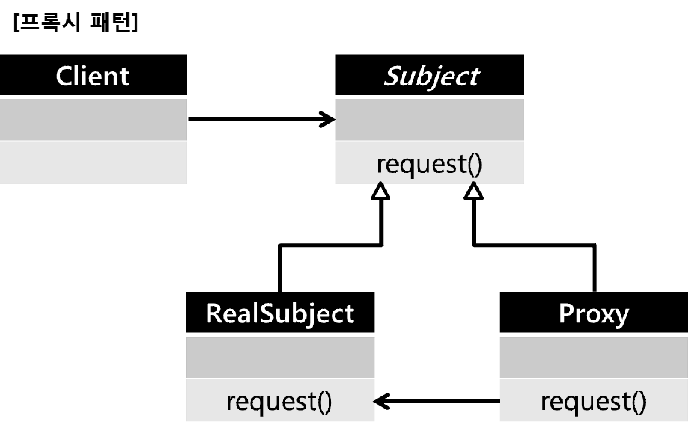

# JPA Getting Started - 4

엔티티를 조회할 때 연관관계를 맺고있는 다른 엔티티도 같이 조회된다.  
하지만 항상 연관된 엔티티 정보가 필요한 것은 아니므로 불필요한 데이터베이스 조회가 생기는 것이다.  
Employee 정보를 얻기위해 아래와 같이 조회한다면 내부적으로 Department 정보까지 동시에 조회를 한다.  
```java
@Entity
public class Employee {
  @Id @GeneratedValue
  @Column("EMPLOYEE_ID")  
  private int id;

  @ManyToOne
  @JoinColumn(name="DEPARTMENT_ID")  
  Department dept;

  ...
}
@Entity
public class Department {
  @Id @GeneratedValue
  @Column("DEPARTMENT_ID")  
  private int id;

  ...
}

// 조회
Employee employee = em.find(Employee.class, "id1");
```
실제로 Department 정보가 필요한 시점에 데이터를 조회하는 방법이 있을까?    
```java
Department department = employee.getDept();  // 이 시점에 조회되게 할 수 있을까?
```
JPA에서는 프록시 객체를 사용하여 위 문제를 해결한다.  

## 프록시
#### 프록시 패턴
프록시 패턴은 어떤 일을 대리인(프록시)에게 위임하여 처리하는 패턴이다.  
원격 객체에 접근하기 위해 사용하거나, 이미지 로딩과 같이 객체 생성 작업이 오래걸리는 경우에 사용된다.  


```java
public class RealSubject {
    public request() {...}
}
public class ProxySubject extends RealSubject {
    private RealSubject realSubject = null;
    public String request() {
        // 실제 데이터가 필요한 시점에 객체 초기화 및 데이터를 불러온다.
        if(realSubject == null) {
           // 초기화 및 참조 보관
           // JPA의 경우 DB 조회
           realSubject = new RealSubject();
        }
        return realSubject.request();
    }
}
public class Client {
   public void selectName() {
      RealSubject proxy = new ProxySubject();
      proxy.request();
      .....
   }
}
```

#### JPA에서 프록시 객체
```java
// EmployeeProxy 객체가 리턴된다.
Employee employeeProxy = em.getReference(Employee.class, "id1");

```
- 프록시 객체를 얻고 초기화하는 작업은 영속성 컨텍스트를 통해서 한다.  
  즉, 프록시 객체는 영속성 컨텍스트에서 관리되고 있는 객체이다.  
  준영속(detached) 상태의 프록시 객체를 사용하려고 하면 예외가 발생된다.  
- 엔티티매니져의 **getReference()** 메소드를 통해서 프록시 객체를 얻을 수 있다.  
- getReference()로 프록시 객체를 얻으려고 할때 이미 영속성 컨텍스트에 실제 객체가 있는경우  
  프록시 객체가 아닌 실제 객체를 리턴한다.
  반면, 프록시 객체를 조회 했다면 find()로 조회 하더라도 실제 객체가 아닌 프록시 객체가 리턴된다.  
  이는 영속성 컨텍스트가 항상 엔티티의 동일성(identity)을 보장하기 위함이다.
  ```java
  // 실제 객체가 먼저 조회되어 영속성 컨텍스트에 존재하는 경우
  Employee realEmployee = em.find(Employee.class, "id1");
  Employee proxyEmployee = em.getReference(Employee.class, "id1");
  // realEmployee, proxyEmployee 모두 실제 엔티티 이다.
  Assert.assertTrue(realEmployee == proxyEmployee); // 성공

  // 프록시 객체를 조회한 뒤 실제 객체를 조회하려고 하는 경우
  Employee proxyEmployee = em.getReference(Employee.class, "id1");
  Employee realEmployee = em.find(Employee.class, "id1");
  // realEmployee, proxyEmployee 모두 프록시 객체이다.
  Assert.assertTrue(realEmployee == proxyEmployee); // 성공

  // 타입 비교
  Assert.assertFalse(proxyEmployee.getClass() == Employee.class);
  Assert.assertTrue(proxyEmployee instanceof Employee);
  ```
- 프록시 객체를 사용시 동등성(equal) 비교시 주의 해야한다.  
  IDE를 통해 자동으로 equals() 오버라이딩 메소드를 생성한 경우 제대로 동작하지 않는다.  
  내부적으로 같은 타입인지 비교하기 위해 getClass()를 사용하고,(프록시 객체는 실제 객체를 상속받음)  
  필드 값들을 비교하기 위해서 getter 메소드가 아닌 필드에 직접 접근하여 값을 얻는다.(프록시 객체가 초기화 되지 않았 을 수 있음)  
  **타입비교는 instanceof를 사용하고, 필드 값은 getter 메소드를 통해 얻어야 한다.**  

```java
@Override
public boolean equals(Object obj) {
    ...
    if(this.getClass() != obj.getClass()) return false;
    ...
    Employee employee = (Employee) obj;
    ...
    if(name!=null ? !name.equals(employee.name) : employee.name != null) return false;
    ...
}
```
```java
@Override
public boolean equals(Object obj) {
    ...
    if(!(obj instanceof Employee)) return false;
    ...
    Employee employee = (Employee) obj;
    ...
    if(name!=null ? !name.equals(employee.getName()) : employee.getName() != null) return false;
    ...
}
```

#### 즉시로딩, 지연로딩
JPA에서 엔티티와 **연관관계를 맺고있는 엔티티들** 을 **지연로딩** 할 때 **프록시 객체** 를 사용한다.  
- 즉시로딩: 엔티티 조회시 연관된 모든 엔티티를 함께 조회
  연관된 엔티티는 **조인쿼리(LEFT OUTTER JOIN)** 을 통해 함께 조회된다.
```java
@Entity
public class Employee {
    ...
    @ManyToOne(fetch= FetchType.EAGER)
    @JoinColumn(name="DEPARTMENT_ID")
    private Department department;
    ...
}
```
  > NOTE  
    JPA에서 즉시 로딩을 할때 내부조인(INNER JOIN)이 아니라 외부조인(LEFT OUTTER JOIN)을 사용한다.  
    이는 null값이 허용되는 경우 데이터가 누락되는 것은 막을 수 있지만, 성능상 안좋을 수 있다.
    INNER JOIN을 사용해야 되는 경우에는 아래와 같이 설정해 주면된다. (둘중 한가지 방법 선택)
    @JoinColumn(name="DEPARTMENT_ID", **nullable=false**)  
    @ManyToOne(fetch= FetchType.EAGER, **optional=false**)

- 지연로딩: 엔티티 조회시 연관된 엔티티는 실제 사용시(호출시) 조회
```java
@Entity
public class Employee {
    ...
    @ManyToOne(fetch= FetchType.LAZY)
    @JoinColumn(name="DEPARTMENT_ID")
    private Department department;
    ...
}
```
- 컬렉션의 즉시로딩, 지연로딩
  * 컬렉션을 즉시로딩으로 설정(FetchType.EAGER)한 경우 optional 설정에 관계 없이 무조건 OUTTER JOIN을 한다.  
  * 컬렉션을 지연로딩 하는 경우 컬렉션 래퍼(PersistentBag)으로 감싸져서 프록시 역할을 수행한다.

```java
@Entity
public class Department {
    ...
    @OneToMany(mappedBy="department", fetch= FetchType.LAZY)
    @JoinColumn(name="DEPARTMENT_ID")
    private List<Employee> employees = new ArrayList<>();
    ...
}

Department department = em.find(Department.class, "did01");
List<Employee> employees = department.getEmployees(); // 아직 조회 안됨.
employees.get(0); // 실제 호출시 Employee를 조회한다.
// employees.getClass().getName() ==> org.hibernate.collection.internal.PersistentBag
  ```

#### 영속성 전이(Transitive Persistence)
엔티티를 저장할 때 연관된 엔티티의 경우 외래키만 참조하여 저장한다.  
엔티티 저장시 연관된 엔티티를 함께 저장하려면 CASCADE 옵션을 사용하면 된다.  
CASCADE 타입 : ALL, PERSIST, MERGE, REMOVE, REFRESH, DETACH  

```java
@Entitype
public class Department {
    @OneToMany(mappedBy="department", cascade=CascadeType.PERSIST)
    private List<Employee> employees = new ArrayList<>();
}
```
```java
// 영속성 전이 미 사용
Department dept = new Department();
em.persist(dept);

Employee employee = new Employee();
employee.setDepartment(dept);
dept.getEmployees().add(employee);
em.persist(employee);
```
```java
// 영속성 전이 사용
Department dept = new Department();

Employee employee = new Employee();
employee.setDepartment(dept);
dept.getEmployees().add(employee);

em.persist(dept); // 한 번에 저장
```

#### 고아객체(ORPHAN) 제거
JPA는 부모 엔티티와 연관관계가 끊긴 경우 자동으로 삭제해 주는 옵션을 제공한다.  
해당 옵션을 설정하면 아래와 같이 remove하는 경우 List<Employee> 에서만 삭제하는 것이 아니라 DB에서도 삭제한다.  
@OneToMany, @OneToOne에서만 지원된다.
```java
@Entitype
public class Department {
    @OneToMany(mappedBy="department", orphanRemoval=true)
    private List<Employee> employees = new ArrayList<>();
}
```
```java
Department dept = em.find(Department.class, "id01");
dept.getEmployees().remove(0); // 연관관계 삭제
// DELETE FROM EMPLOYEE WHERE EMPLOYEE_ID = ? 실행 됨
dept.getEmployees().clear();  // 연관된 모든 Employee 삭제됨
```
