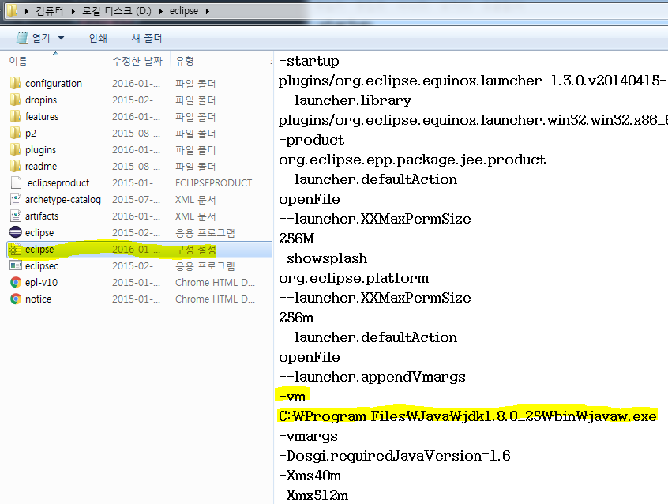

# JPA Getting Started - 5

## 객체지향 쿼리 언어
EntityManager.find()는 식별자로 하나의 엔티티를 조회할 수 있었다.  
JPA는 좀 더 복잡한 검색을 위해서 다양한 객체지향 쿼리 기술을 제공 한다.  

- JPQL: Java Persistence Query Language
- 네이티브 SQL: SQL을 직접 사용
- Criteria 쿼리: JPQL을 쉽게 사용하더록 도와주는 API(빌더 클래스)
- QueryDSL: Criteria 쿼리와 같음. 비표준 오픈소스 프레임워크.
- 기타: JDBC나 MyBatis같은 매퍼 프레임워크를 JPA와 함께 사용 하는 방법도 제공한다.  

#### JPQL
JPQL은 엔티티 객체를 조회하는 JPA 표준 객체지향 쿼리로 SQL과 유사하다.  
JPQL은 SQL을 추상화 하기 때문에 데이터베이스에 종속되지 않고,  
설정된 데이터베이스 Dialect가 각 데이터베이스 맞는 SQL을 생성 및 실행한다.  
JPQL로 조회된 엔티티는 영속성 컨텍스트에서 관리된다.  
**em.createQuery()** 로 JPQL을 실행한다.  
```Java
String jpql = "select e from Employee e where e.name = 'kihoon'";
List<Employee> employees = em.createQuery(jpql, Employee.class).getResualtList();
```

#### 네이티브 SQL
**em.createNativeQuery()** 로 SQL을 직접 실행한다.  
```Java
String sql = "select ID, NAME, DEPARTMENT_ID from EMPLOYEE where NAEM = 'kihoon'";
List<Employee> employees = em.createNativeQuery(sql, Employee.class).getResualtList();
```
#### Criteria 쿼리
Criteria 쿼리는 JPQL을 생성하는 빌더 클래스이다.  
프로그래밍 코드 형식으로 JPQL 을 작성하기 때문에 컴파일 시점에 오류를 발견할 수 있는 등 여러 장점이 있지만,  
아래 코드와 같이 코드자체가 복잡하고 가독성도 떨어진다.  
```Java
// JPQL: "select e from Employee e where e.name = 'kihoon'"
CriteriaBuilder cb = em.getCriteriaBuilder();

CriteriaQuery<Employee> query = cb.createQuery(Employee.class);
Root<Employee> e = query.from(Employee.class);
CriteriaQuery<Employee> cq = query.select(e).where(cb.equal(e.get("name"), "kihoon"));

List<Employee> employees = cq.createQuery(cq).getResualtList();
```

#### QueryDSL  
Criteria 쿼리와 같은 JPQL을 생성하는 빌더 클래스이지만 더 단순하고 쉽다.  
JPA표준은 아니지만 가장 많이 사용되는 오픈소스 프로젝트이다.  
많이 사용되기 때문에 아래쪽에서 상세히 알아보도록 하자.  
```Java
// JPQL: "select e from Employee e where e.name = 'kihoon'"
JPAQuery query = new JPAQuery(entityManager);
QEmployee employee = QEmployee.employee; // 엔티티 클래스 기반으로 쿼리전용 클래스를 미리 만들어야 된다.

List<Employee> employees = query.from(employee)
                                .where(employee.name.eq("kihoon"))
                                .list(employee);
```  

#### JDBC나 MyBatis 직접 사용
JDBC나 MyBatis를 직접 사용하는 경우 영속성 컨텍스트에서 관리가 되지 않기 때문에 SQL 실행 전에 **강제로 플러시** 해줘야 된다.  
```Java
Session session = entityManager.unwrap(Session.class);
session.doWork(new Work() {
    @Override
    public void execute(Connection connection) throws SQLException {
        // do something..
    }
});
```

## QueryDSL 상세
[QueryDSL 레퍼런스 문서](http://www.querydsl.com/static/querydsl/3.6.3/reference/ko-KR/html_single/)

#### 메이븐 환경 설정
- Dependency 설정: querydsl-apt, querydsl-jpa
- APT 빌드 플러그인 설정: **JPAAnnotationProcessor** 는 **@Entity** 을 가진 도메인 타입을 찾아서 **쿼리 타입** 을 생성

```xml
<dependencies>
  <dependency>
    <groupId>com.mysema.querydsl</groupId>
    <artifactId>querydsl-apt</artifactId>
    <version>3.6.3</version>
    <scope>provided</scope>
  </dependency>
  <dependency>
    <groupId>com.mysema.querydsl</groupId>
    <artifactId>querydsl-jpa</artifactId>
    <version>3.6.3</version>
  </dependency>
</dependencies>
<build>
  <plugins>
    ...
    <plugin>
      <groupId>com.mysema.maven</groupId>
      <artifactId>apt-maven-plugin</artifactId>
      <version>1.1.3</version>
      <executions>
        <execution>
          <goals>
            <goal>process</goal>
          </goals>
          <configuration>
            <outputDirectory>target/generated-sources/java</outputDirectory>
            <processor>com.mysema.query.apt.jpa.JPAAnnotationProcessor</processor>
          </configuration>
        </execution>
      </executions>
    </plugin>
    ...
  </plugins>
</build>
```
> **NOTE**  
  pom.xml에 메이븐 설정 후 아래와 같은 에러가 난다면..  
  *You need to run build with JDK or have tools.jar on the classpath.  
  If this occures during eclipse build make sure you run eclipse under JDK as well   (com.mysema.maven:apt-maven-plugin:1.1.3:process:default:generate-sources)*   

> eclipse.ini 파일에 JDK가 설치된 경로를 추가해준다.(-vmargs 바로 위에 적어야 된다.)  
  -vm C:\\Program Files\\Java\\jdk1.8.0_25\\bin\\javaw.exe  
    

#### 조회 쿼리
쿼리타입을 사용한다. 쿼리타입의 변수명을 from에 넘겨주는데 이는 JPQL 생성시 alias로 사용된다.  
from(), where(), orderBy(), offset(), limit(), groupBy(), having() 등을 사용하고,  
최종 결과를 조회 할때 list(), uniqueResult(), singleResult() 를 사용할 수 있다.
```java
public void selectQueryDSL() {
  JPAQuery query = new JPAQuery(em);
  QMember member = QMember.member;  // 쿼리 타입
  List<Member> list = query.from(member)
                           .where(member.username.eq("kihoon"))
                           .groupBy(member.age)
                           .having(member.age.gt(30))
                           .orderBy(member.age.desc())  // 정령
                           .offset(10).limit(20)        // 페이징
                           .list(member);               // 결과 조회
}
```
```sql
-- hibernate에 의해 자동 생성된 SQL
select member0_.ID as ID1_0_,
       member0_.age as age2_0_,
       member0_.NAME as NAME3_0_
  from MEMBER member0_
 where member0_.NAME=?
group by member0_.age
  having member0_.age>?
order by member0_.age desc
  limit ?
 offset ?
```
#### 조인
innerJoin(), leftJoin(), rightJoin(), fullJoin()을 지원하고,  
조인 조건을 위해 on(), 페치 조인을 위해 fetch()를 지원한다.  
```Java
// Inner 조인
query.from(employee)
     .innerJoin(department)
     .on(department.name.eq("dev"))
     .list();
// fetch 조인
query.from(employee)
     .innerJoin(department).fetch()
     .leftJoin(meeting).fetch()
     .list();
//  theta 조인
query.from(employee, department)
     .where(employee.department.eq(department))
     .list();
```

#### 서브 쿼리
**com.mysema.query.jpa.JPASubQuery** 를 사용한다.  
```Java
query.from(member)
		 .where(member.age.eq(
			 new JPASubQuery().from(subMember).unique(subMember.age.max())
		 ))
     .list(member);
```

#### 프로젝션
**프로젝션** 이란 select 절이 조회할 대상을 지정하는 것이다.  
JPA는 Map과 비슷한 **com.mysema.query.Tuple** 이라는 타입을 통해 결과를 반환하거나,  
**com.mysema.query.types.Projections** 를 통해 특정 객체(DTO)로 결과를 반환 할 수 있다.  
프로젝션으로 조회된 값들은 엔티티가 아니므로 영속성 컨텍스트에서 관리되지 않는다.  

- 프로젝션 대상 컬럼이 하나일때
```Java
JPAQuery query = new JPAQuery(em);
QMember member = QMember.member;
List<String> names = query.from(member).list(member.username);
for (String name : names) {
	System.out.println(name);
}
```
- 프로젝션 대상 컬럼이 여러개 일때
```java
JPAQuery query = new JPAQuery(em);
QMember member = QMember.member;
List<Tuple> tupleList = query.from(member).list(member.username, member.age);
for (Tuple tuple : tupleList) {
	System.out.println(tuple.get(member.username));
	System.out.println(tuple.get(member.age));
}
```
- 특정 객체에 자동 매핑하려고 할 때  
```java
JPAQuery query = new JPAQuery(em);
QMember member = QMember.member;
// setter를 통해 값을 세팅
List<MemberDTO> dtoList1 = query.from(member).list(
      	  			          Projections.bean(MemberDTO.class, member.username, member.age)
      	  				);
// 멤버 필드를 통해 값을 세팅                          
List<MemberDTO> dtoList2 = query.from(member).list(
      	  			          Projections.fields(MemberDTO.class, member.username, member.age)
      	  				);
// 생성자를 통해 값을 세팅. 파라메터 순서와 동일한 생성자가 존재해야 된다.
List<MemberDTO> dtoList3 = query.from(member).list(
      	  			          Projections.constructor(MemberDTO.class, member.username, member.age)
      	  				);
// DTO 객체
class MemberDTO {
	private String username;
	private int age;

	public MemberDTO() {}

	public MemberDTO(String username, int age) {
		this.setUsername(username);
		this.setAge(age);
	}

	public String getUsername() {
		return username;
	}
	public void setUsername(String username) {
		this.username = username;
	}
	public int getAge() {
		return age;
	}
	public void setAge(int age) {
		this.age = age;
	}
}
```

#### 수정, 삭제 쿼리
수정, 삭제 쿼리는 영속성 컨텍스트와 상관없이 데이터베이스에 직접 실행하므로 주의해야 한다.  
```Java
QMember member = QMember.member;
JPAUpdateClause  updateClause = new JPAUpdateClause(em, member);
updateClause.where(member.id.eq("id001"))
            .set(member.username, "kihoon")
            .set(member.age, 30)
            .execute();
```
```java
QMember member = QMember.member;
JPADeleteClause deleteClause = new JPADeleteClause(em, member);
deleteClause.where(member.id.eq("id001"))
            .execute()
```

#### 동적 쿼리
**com.mysema.query.BooleanBuilder** 를 사용하여 동적쿼리를 작성할 수 있다.  
```java
String search_name = "";
Integer search_age=30;

JPAQuery query = new JPAQuery(em);
QMember member = QMember.member;

BooleanBuilder builder = new BooleanBuilder();
if(StringUtils.hasText(search_name)) {
	builder.and(member.username.contains(search_name));
}
if(search_age != null) {
	builder.and(member.age.lt(search_age));
}

List<Member> members = query.from(member).where(builder).list(member);
```
